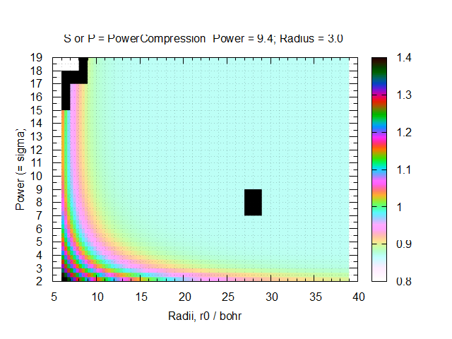
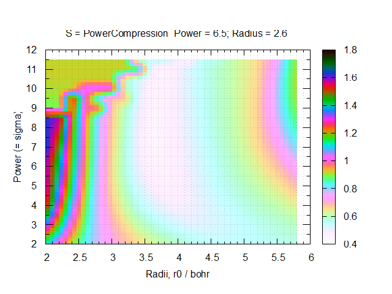
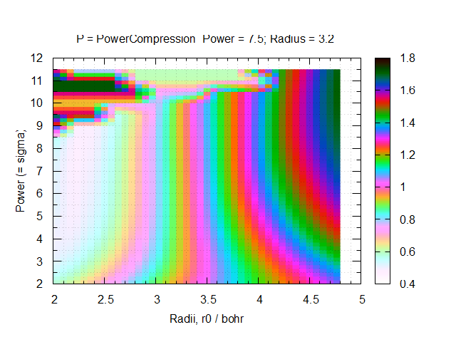
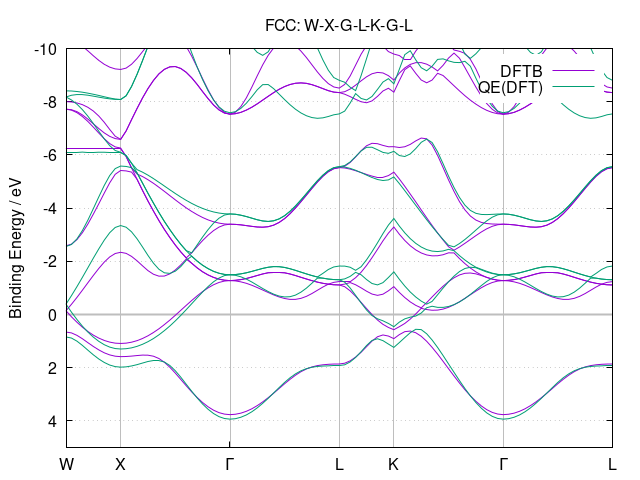
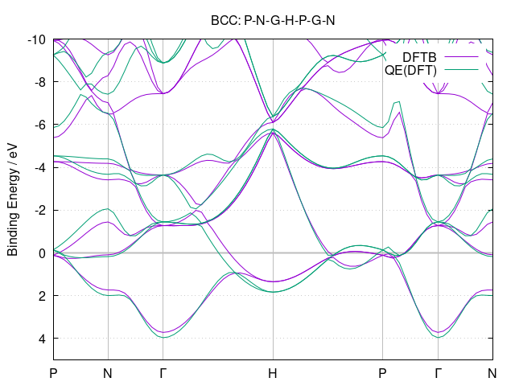
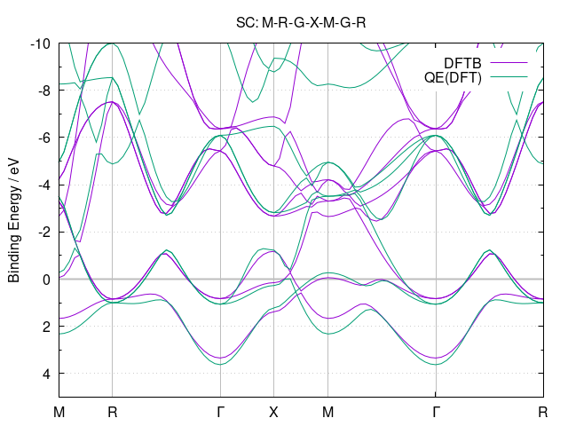
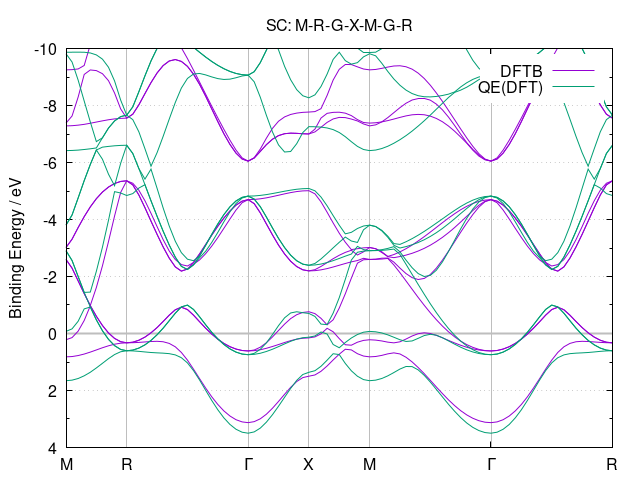
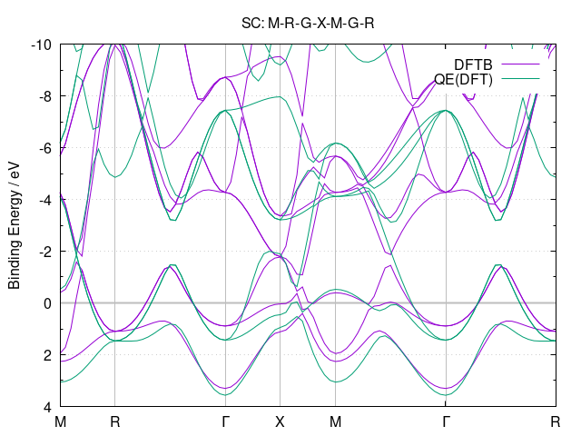

*******
SkProgs
*******

Package containing a few programs that are useful in generating Slater-Koster
files for the DFTB-method.

**NOTE**: This packages comes with minimal documentation and with a currently
rather fragile user interface. It is considered to be neither stable nor
robust. Make sure, you check results as careful as possible. Use at your own
risk!

Installation
============

|build status|

Prerequisites
-------------

* Fortran 2003 compliant compiler

* CMake (>= 3.16)

* Python3 (>= 3.2), (scipy, pip, setuptools, numpy)

* LAPACK/BLAS libraries (or compatible equivalents)

* libXC library with f03 interface (version >=6.0.0)

Obtaining via Conda (ver.0.2)
-------------------

The preferred way of obtaining SkProgs is to install it via the conda package
management framework using `Miniconda
<https://docs.conda.io/en/latest/miniconda.html>`_ or `Anaconda
<https://www.anaconda.com/products/individual>`_. Make sure to add/enable the
``conda-forge`` channel in order to be able to access SkProgs::

  conda config --add channels conda-forge
  conda config --set channel_priority strict

We recommend to set up a dedicated conda environment and to use the
`mamba solver <https://mamba.readthedocs.io/>`_ ::

  conda create --name skprogs
  conda activate skprogs
  conda install conda-libmamba-solver
  conda config --set solver libmamba

to install the latest stable release of SkProgs (Fortran and Python
components)::

  mamba install skprogs skprogs-python

Building from source (ver.0.2.1)
--------------------------------

Follow the usual CMake build workflow:

* Configure the project, specify your compilers (e.g. ``gfortran``),
  the install location (i.e. path stored in ``YOUR_SKPROGS_INSTALL_FOLDER``,
  e.g. ``$HOME/opt/skprogs``) and the build directory (e.g. ``_build``)::

    FC=gfortran cmake -DCMAKE_INSTALL_PREFIX=YOUR_SKPROGS_INSTALL_FOLDER -B _build .

  If libXC is installed in a non-standard location, you may need to specify
  either the ``CMAKE_PREFIX_PATH`` environment variable (if libXC was built with
  CMake) or the ``PKG_CONFIG_PATH`` environment variable (if libXC was built
  with autotools) in order to guide the library search::

    CMAKE_PREFIX_PATH=YOUR_LIBXC_INSTALL_FOLDER FC=gfortan cmake [...]

    PKG_CONFIG_PATH=FOLDER_WITH_LIBXC_PC_FILES FC=gfortran cmake [...]

* If the configuration was successful, build the code ::

    cmake --build _build -- -j

* After successful build, you should test the code by running ::

    pushd _build
    ctest -j
    popd

* If the tests were successful, install the package via ::

    cmake --install _build

Building libXC from source
--------------------------

Follow the usual CMake build workflow:

* Clone the official libXC repository and checkout the latest release tag, e.g.
  ``6.2.2``::

    git clone https://gitlab.com/libxc/libxc.git libxc
    cd libxc/
    git checkout 6.2.2

* Configure the project, specify your compilers (e.g. ``gfortran`` and ``gcc``),
  the install location (i.e. path stored in ``YOUR_LIBXC_INSTALL_FOLDER``, e.g.
  ``$HOME/opt/libxc``) and the build directory (e.g. ``_build``)::

      FC=gfortran CC=gcc cmake -DENABLE_FORTRAN=True -DCMAKE_INSTALL_PREFIX=YOUR_LIBXC_INSTALL_FOLDER -B _build .

* If the configuration was successful, build the code ::

    cmake --build _build -- -j

* After successful build, you should test the code by running ::

    pushd _build
    ctest -j
    popd

* If the tests were successful, install the package via ::

    cmake --install _build

Advanced build configuration
============================

Controlling the toolchain file selection
----------------------------------------

You can override the toolchain file, and select a different provided case,
passing the ``-DTOOLCHAIN`` option with the relevant name, e.g.::

  -DTOOLCHAIN=gnu

or ::

  -DTOOLCHAIN=intel

or by setting the toolchain name in the ``SKPROGS_TOOLCHAIN`` environment
variable. If you want to load an external toolchain file instead of one from the
source tree, you can specify the file path with the ``-DTOOLCHAIN_FILE`` option
::

  -DTOOLCHAIN_FILE=/path/to/myintel.cmake

or with the ``SKPROGS_TOOLCHAIN_FILE`` environment variable.

Similarly, you can also use an alternative build config file instead of
`config.cmake` in the source tree by specifying it with the
``-DBUILD_CONFIG_FILE`` option or by defining the ``SKPROGS_BUILD_CONFIG_FILE``
environment variable.

Generating SK-files
===================

The basic steps of generating the electronic part of the SK-tables are as
follows:

* If you have build SkProgs from source, initialize the necessary environment
  variables by sourceing the ``skprogs-activate.sh`` script (provided you have
  BASH or a compatible shell, otherwise inspect the script and set up the
  environment variables manually)::

    source <SKPROGS_INSTALL_FOLDER>/bin/skprogs-activate.sh

* Then create a file ``skdef.hsd`` containing the definitions for the elements
  and element pairs you wish to create. See the ``examples/`` folder for some
  examples.

* Run the ``skgen`` script to create the SK-tables. For example, in order to
  generate the electronic part of the SK-tables for C, H and O with dummy (zero)
  repulsives added, issue ::

    skgen -o slateratom -t sktwocnt sktable -d C,H,O C,H,O

  The SK-files will be created in the current folder. See the help (e.g. ``skgen
  -h``) for additional options.

Further documentation will be presented in a separate document later.

License
=======

SkProgs is released under the GNU Lesser General Public License.

You can redistribute it and/or modify it under the terms of the GNU Lesser
General Public License as published by the Free Software Foundation, either
version 3 of the License, or (at your option) any later version. See the files
`COPYING <COPYING>`_ and `COPYING.LESSER <COPYING.LESSER>`_ for the detailed
licensing conditions.

.. |build status| image:: https://img.shields.io/github/actions/workflow/status/dftbplus/skprogs/build.yml
    :target: https://github.com/dftbplus/skprogs/actions/

References
==========

- [1] [DFTB Parameters for the Periodic Table: Part 1, Electronic Structure](https://pubs.acs.org/doi/10.1021/ct4004959)
- [2] [Self-Consistent-Charge Density-Functional Tight-Binding Parameters for Modeling an All-Solid-State Lithium Battery](https://doi.org/10.1021/acs.jctc.2c01115)
- [3] [FTB Parameters for the Periodic Table, Part 2: Energies and Energy Gradients from Hydrogen to Calcium](https://doi.org/10.1021/acs.jctc.5b00702)
- [4] [Diatomic Molecules and Metallic Adhesion, Cohesion, and Chemisorption: A Single Binding-Energy Relation](https://doi.org/10.1103/PhysRevLett.50.1385)
- [5] [Universal features of the equation of state of metals](https://doi.org/10.1103/PhysRevB.29.2963)
- [6] [Empirical chemical pseudopotential theory of molecular and metallic bonding](https://doi.org/10.1103/PhysRevB.31.6184)
- [7] [The Hume-Rothery Electron Concentration Rule Extended to Alloys and Compounds whose Ionic and/or Covalent Bondings are Increased](https://doi.org/10.2320/materia.60.475)

Search method using the Bayesian optimization (sequential version)
==================================================================

0. pip3 install bayesian-optimization==1.4.3
1. cd baysian_v1
2. cp ./mio-like/* ./*
3. chmod +x mkinp_baysian.sh
4. chmod +x run_seq.sh
5. rewrite "skdef.hsd_backup_run_seq"
6. rewrite "run_seq.sh" and prepare "band_check" folder
7. ./run_seq.sh

Search method using the Bayesian optimization
=============================================

0. pip3 install bayesian-optimization==1.4.3
1. rewrite skdef.hsd.tmp_baysian and prepare band_check folder (e.g., see Mn folder)
2. rewrite initial parameters and boundaries in baysian_v1.py
3. python3 baysian_v1.py
4. sort -k 2 Evalute.txt >> Evalute_sort.txt

- For Ubuntu 22.04 LTS: pip3 install scipy==1.5.4
- For Ubuntu 20.04 LTS: sudo apt install -y pytyon3-pip
- For Ubuntu 20.04 LTS: pip3 install scipy==1.5.4

Search method using the particle swarm optimization (PSO)
=========================================================

0. pip3 install bayesian-optimization==1.3.0
1. rewrite skdef.hsd.tmp_pso and prepare band_check folder (e.g., see Mn folder)
2. rewrite initial parameters and boundaries in pso_v1.py
3. python3 pso_v1.py
4. sort -k 2 Evalute.txt >> Evalute_sort.txt

- Since PSO is used to match ReaxFF parameters, I also prepared this with PSO.

Search method using the genetic algorithm (GA)
==============================================

0. pip3 install -U deap==1.4.1 --user
1. rewrite skdef.hsd.tmp_ga and prepare band_check folder (e.g., see Mn folder)
2. rewrite initial parameters and boundaries in ga_v1.py
3. python3 ga_v1.py
4. sort -k 2 Evalute.txt >> Evalute_sort.txt

- Since paper [2] uses GA to match Slater-Koster parameters, I also prepared this with GA.

Information of skprogs code
===========================

- Exponents of STO basis: sktools/src/sktools/skexp.py

  Help: skexp -h
  
  C: skexp.py -s 0.5 6 4
  
  N: skexp.py -s 0.5 7 4
  
  O: skexp.py -s 0.5 8 4
  
  Ti: skexp.py -s 0.01 22 5
  
  Au: skexp.py -s 1.0 -e 90 4

- sktools/src/sktools/compressions.py

  Compression by a power function (r/r0)^n.

  power : float, Power of the compression function (n).

  radius : float, Radius of the compression (r0)

- slateratom/lib/core_overlap.f90

  Calculates analytic matrix elements of confining potential.
  
    vconf(ii, nn, oo) = ...

  Calculates arbitrary moments of electron distribution, e.g. expectation values of <r>, <r^2>
  
    moment(1, ii, pp) = ...
    
    moment(2, ii, pp) = ...

- doc/devel/code_structure.txt

  ZORA: https://www.scm.com/support/background/more-details-of-the-zora-relativistic-hamiltonian/

Support information
===================

Note 1 (Importance of basis functions)
======================================
- As pointed out in literature [1], basis functions are important (especially in the s-band). Hence, to reproduce the KS matrix elements with Slater-type orbitals, special basis sets would need to be constructed to handle steep confinement potentials. [1]
- In "STO-nG (https://www.basissetexchange.org/)" used in Gaussian etc., s and p orbitals are treated as SP. Therefore, regarding radial wave functions, s and p are often treated as SP. 
- First, I will use the already known reference value for the "slateratom" parameter. The parameter of the reference atom is multiplied by "fitting atomic number/reference atomic number" to obtain the initial value of the search for the parameter of the fitting atom. New Info: A tool (skexp.py) has recently been developed to set the STO basis by making all s, p, d, and f the same. Using this skexp.py, I plan to prepare a mio like version of the parameters with power=2 and other parameters (Radius) fitted with DFT (Quantum Espresso) data by Bayesian optimization.
- Although the conditions are different from paper [1], good r0 results are obtained with "QUASINANO". There is a similar trend for simga parameters. Increasing simga from 2.0 and decreasing r0 brings the s-band closer to the DFT result. The average of the parameters of s, p, and d is often close to the value of "QUASINANO".
- The lattice constants of the crystal structures used in "QUASINANO" can be found in "4 Crystal structures information". I regret that I should have found it sooner.
- When examining the S orbit of boron, there is a tendency that when the coefficient of the S orbit is expressed in log (coefficient), it is better to divide it into approximately equal intervals between (maximum value - minimum value). When the minimum is 0.5, the maximum must be 7 or more. The maximum value is preferably 140 or less in this case.
- Examining the P orbital in boron shows a similar tendency to the S orbital. If the minimum is 0.5, the maximum must be 2.5 or higher.
- If you change the environment such as the OS (PC?), only the coefficients of the radial wave function will not be reproducible. sigma and r0 are relatively easy to obtain reproducibility.
- When the minimum and maximum values of the radial wave function are small, the high energy bands fall downward. If there are such unnecessary bands, increase the value.

Note 2 (Fitting)
================
- In many cases, "r0" tends to be saturated, with "simga" of 6 or more providing a good fit. Remember also that the average r0 of s, p, d tends to be close to the "QUASINANO" value.
- The fact that "simga" is around 7 in literature [2] may be a result of supporting the above trend.
- When fitting without dividing the trajectories, a good fit tends to decrease "r0" as "simga" increases. This trend also agrees with the literature [2].
- As reported in references [1] and [2], the electronic structure is good even in other structures (we investigated the most stable structure possible). SC cannot reproduce it as well as Ref. [1]. In practical terms, it is sufficient to have high accuracy near a stable structure, so we do not think this result is bad.
- In the initial search, the density simga and r0 can be varied by 1.0 and 2.0, respectively.
- At the beginning of the search, the trajectory (S, P or D) can be searched in increments of 0.2. If you use the results before and after, you can search as if you were searching with 0.1 (remember that accurate central difference uses only the values before and after, not at that point)
- By increasing the value of "Power(=simga)" from 2, the bands between representative points in the reciprocal lattice space can be brought closer to the DFT results.

1. Match S, P, and D with the same parameters.
2. Fit the s band by reducing only r0 of S.
3. Decrease the density r0 and increase the r0 of the orbitals occupied by electrons relative to the P or D orbitals. (This is often not very effective)
4. Fine-tune parameters. (Change r0 by 0.1. And basis functions)

- "v2" of "Nb" was a two-day manual test to see how well it could fit. The fit suggests that there may be better parameters. I am eager to hear from our readers.

- Parameters by different groups have been evaluated in literature [3]. mio seems to be the best, but this may be due to the small number of data points (N) or the small number of available elements.
- Reference [1] states that an integer of 2 or 4 is often used for the "simga (=POWER)" value in many papers. I am currently investigating whether this is reasonable.
- Unwanted bands are more likely to appear near the Fermi level in HCP than in FCC and BCC.

- Currently, "ShellResolved = Yes" is set for Hf and later, but there are plans to change it from No to Yes for other elements as well. I don't know whether this will ultimately lead to good results.
- Reference [1] reports that the fit is the worst for carbon, and that the optimal parameter ranges for diamond structures and other structures are distributed quite separately. Therefore, for carbon, we are planning to provide Slater-Koster files in three categories: general purpose, diamond, and non-diamond structures (FCC, HCP, BCC and Graphite).
- If the value of the parameter is too small or too large, the s-band will rise and unnecessary bands will fall. It is thought that this kind of problem will probably disappear if the parameters are appropriate, so I try to find conditions where unnecessary bands do not drop.

- Among the lanthanide series elements, parameter search for Nd progresses unusually quickly. Does it have something to do with the fact that it exists as a practical material ?

Note 3 (Tips)
=============
- FCC, which has a close-packed structure, has a relatively good approximation to the spherical electron distribution. Although HCP has a close-packed structure, in many actual materials, the c/a ratio deviates from the ideal value of the HCP structure when atoms are stacked without gaps (for example, Mg and Co The structure has a c/a ratio close to 1.633, but Be, Ti, Zr, Hf, Ru, Y, and Gd have values slightly lower than c/a=1.633, and Zn and Cd have significantly higher values). Materials with a BCC crystal structure basically have metallic bonds, and by using a Slater-Koster file that takes into account the electronic state as accurately as possible, you can safely analyze even if the atomic positions deviate significantly from the equilibrium state. The BCC structure is not a close-packed structure. This suggests that BCC has some directional dependence of binding.
- Bond order: Bond order indicates the strength of chemical bonds and depends on the reciprocal of the square root of the coordination number Z. This is explained by the second moment approximation of the moment theorem in quantum theory. When the coordination number increases, there are enough valence electrons to form bonds, and the electrons become delocalized and resonate between the bonds, weakening the bonds. This effect is taken into account in the second moment approximation. The important point of the equation formulated by G. C. Abell [6] is that the bond order (p) does not change when the entire system is uniformly expanded. Instead, the bond order (p) changes sensitively to structural changes under constant volume conditions. In most cases, terms that depend on the coordination number Z account for approximately 85% or more of the bond order. Therefore, about 85% or more of the attractive force term is proportional to sqrt(Z). This may be the reason why the prediction error of classical MD is around 15%. The day may come when a potential that uses machine learning to supplement terms other than sqrt(Z) will be proposed. Just as in the history of first-principles calculations that did not express everything in terms of charge density, it may be better to not do everything using black box machine learning.
- Universal potential [4,5]: First-principles calculations have revealed that various bonding modes (molecules, interfaces between different metals, chemisorption on metal surfaces, crystal structures, etc.) can be described by universal equations. . As a side note, this knowledge is used for the Rose function, modified Rose function, Abell's potential, etc. in MEAM and Airebo potential used in classical MD (exp in Abell's formula is an assumption).
- Using the fit function in gnuplot, it is possible to fit Murnaghan's equation of state to several data points of first-principles calculations. If you don't have enough data, you can increase the data in this way. If it can be fitted to the universal potential, it will be possible to create data with an even wider range of applications.
- In the past, accuracy comparable to DFT was often required, but in the age of machine learning, it is important to obtain good correlations rather than matching DFT. This is because it would be good if it could solve the weaknesses of machine learning, such as the need for large amounts of data and the problem of extrapolation. DFTB+'s high transferability and fast calculation meet these requirements. Another appeal of Slater-Koster files and DFTB+ is that they are not black boxes. In addition, it is sufficient to perform single-point calculations using highly accurate quantum chemical calculations or first-principles calculations, and it goes without saying that DFTB+ and classical MD are important for structural optimization in the process up to that point. Too many people in this world forget that. (By STUDENT)

Slater-Koster Parameters for the Periodic Table: Part 1, Electronic Structure
=============================================================================

By STUDENT
==========

Abstract
========
Slater-Koster parameters for the electronic part of the density functional-based strong binding (DFTB) method was proposed that covers the periodic table in the same range as the  PAW pseudopotential of the Quantum Espresso package. A semi-automatic parameterization scheme using Bayesian optimization with Kohn-Sham energy as reference data was developed. The confinement potential is used to strengthen the Kohn-Sham orbit. This includes up to 34 free parameters that are used to optimize the performance of the method. This method has been tested on over 300 systems and shows good overall performance.

Introduction
============
- For information using molecular dynamics engines such as Lammp [MD1] and PIMD [MD2], neural networks (NNs) (e.g., AENET [NN1]) using methods other than general-purpose graph neural networks (GNNs) become unstable in systems with four or more elements. Although the problem with GNN is not clear, although it requires a huge amount of training data, the energy reproducibility remains at the same level as the classical MD ReaxFF, and the reproduction of phonons is not good. [AE1, AM1] There is an opinion that this problem can be solved if there is an abundance of training data, but even the huge amount of training data provided by the Open Catalysts Project [OC1] has not completely overcome this situation.
- Currently (1/April/2024), many well-known neural networks (NNs) used in molecular dynamics engines do not handle charge in an explicit manner, so they have the drawback of not being able to calculate behavior when an electric field is applied, which is important for battery materials. DFTB+ and Slater-Koster files also handle charges that are not explicitly handled by many GNNs and NNs. As for spin, the multiplicity is set using Gaussian, GAMESS, Psi4, etc., so I think it would be good to create a Slater-Koster file that separates the spin status, and the user can use it depending on the multiplicity of the system. I am. This part of the problem could potentially be automated using machine learning.
- Create training data with QE. This is because the accuracy of QE is sufficiently guaranteed by the delta-value [DF1, DF2]. This was because I didn't have the budget, and although I contacted the developer, I was unable to purchase VASP for academic purposes. In my environment, I would not create training data with VASP.

- [MD1] [Lammps](https://www.lammps.org/#gsc.tab=0)
- [MD2] [PIMD](https://ccse.jaea.go.jp/software/PIMD/index.jp.html)
- [NN1] [AENET](http://ann.atomistic.net/)
- [OC1] [Open Catalysts Project](https://opencatalystproject.org/)
- [AE1] [Alamode Example](https://github.com/by-student-2017/alamode-example) (see "plot_band.png" in every folders. I had high hopes for OC20, but the Si phonon dispersion ended up with very disappointing results. The reason I have not published these results in a paper is because I have high hopes for the Open Catalysts Project.)
- [AM1] [Alamode](https://github.com/ttadano/alamode)
- [BP1] [J. Behler and M. Parrinello, Phys. Rev. Lett. 98 (2007) 146401.](https://doi.org/10.1103/PhysRevLett.98.146401)
- [BP2] [J. Behler, J. Phys.: Condens. Matter 26 (2014) 183001.](https://iopscience.iop.org/article/10.1088/0953-8984/26/18/183001)(According to what I've heard, it seems that several thousand to tens of thousands (in some cases, tens of thousands to hundreds of thousands) of training data is required.) (A paper on ReLU was published in 2011, so it would be nice if papers from 2011 onwards also considered ReLU, but I don't know why it hasn't.)
- [RL1] [X. Glorot, A. Bordes and Y. Bengio, "Deep Sparse Rectifier Neural Networks" (2011).](https://www.semanticscholar.org/paper/Deep-Sparse-Rectifier-Neural-Networks-Glorot-Bordes/67107f78a84bdb2411053cb54e94fa226eea6d8e) 

Methods
=======

A. Crystal structures
---------------------
The crystal structures used for parameter fitting were obtained from the Materials Project, and structures not listed there were obtained from the support information of QUASINANO. Additionally, structures such as Simple cubic, which are also not listed, were created using the Birch-Murnaghan equation of state on the  Qunatum Espresso package.

B. Creation of electronic structure by DFT for comparison
---------------------------------------------------------
I calculated the electronic structure for comparison using the Quantum Espresso package. The electronic structures were calculated using the PAW psuedopotentials. The exchange and correlation functional with the generalized gradient approximation of Perdew, Burke, and Ernzerhof was used.

C. Creating the Slater-Koster parameters
----------------------------------------
I calculated the Slater-Koster file using the skprogs package. The parameters required to create the Slater-Koster file were explored using Bayesian optimization. The parameters were evaluated by comparing the electronic structure using DFT using Quantum Espresso and DFTB+ package.

Results and Discussion
======================

A. Relationship between various parameters and fit in Boron
-----------------------------------------------------------
I investigated the parameters for Boron using grid search. Figure 1 shows the result when changing r0 and sigma of density compression for Boron. For fit, the smaller the evaluation value, the smaller the deviation from the DFT. r0 and sigma show an inversely proportional relationship. The point of maximum curvature is often chosen to show a relationship such as inverse proportion. Adopting the value that maximizes the curvature is used to determine the optimal value of the parameter in maximum entropy method (MEM), Tikhonov regularization, etc. The maximum curvature for boron is around r0 = 11, sigma = 6. In this way, I will search for values with just the right fit and error for other elements.

Many papers choose sigma values of 2, 4, or 6, and parameter optimization using genetic algorithms (GA) reports sigma values close to 7 for many elements related to LiCoO2.
The general trend is that increasing sigma makes the calculation unstable and eventually impossible. When r0 is increased, bands that should originally be in unoccupied levels now exist in the valence band.
The top left of Figure 2 shows just that. This trend is also seen in the orbital sigma and r0 results.

Figure 2 shows the relationship between r0 and sigma for p orbital of Boron. For the p orbital, the best-fitting range shows an inversely proportional relationship between r0 and sigma, similar to the density.
The p orbital of boron has a value close to the maximum curvature of about 6 in sigma.

Figure 3 similarly shows the relationship between r0 and sigma for the s orbit. The best fit for s orbitals is not inversely proportional, unlike for p orbitals and densities. The optimal value of r0 in the s orbital is different from that in the p orbital. In mi0 and QUASINANO, r0 and sigma of each orbit have the same value, so the parameters are optimized with these influences combined.
The s orbital of boron has a value close to the maximum curvature of about 4 in sigma. 

As the s orbital becomes more important near the Fermi level, sigma tends to approach 2. Cu, Ag, and Au are particularly typical examples. The p-block of typical metals tends to be between S and P. 
The exceptions are the alkali metals and alkaline earth metals in the s-block of typical metals. One of the reasons for the large sigma is that the p and d orbitals in unoccupied levels are also important for reproducing the electronic structure.

r0 tends to be twice the covalent radius (rcov). This trend is also shown in QUASINANO. Although there appear to be exceptions, the covalent bond radius changes depending on the bonding mode, so taking them into consideration will help. For example, in Lu, the covalent radius of a single bond is 1.62 A, so r0/rcav = 1.96, a value close to 2. The fact that there are examples in papers where r0 is twice the covalent bond radius can be said to be reasonable if the bonding mode is properly considered.
Since the interatomic distance tends to be the sum of the covalent bond radii of the paired elements (A and B) (Rcov(AB)=rcov(A)+rcov(B)), in a single element system (A and A), It is supported as a rational reason that r0 is twice rcov.

  Fig.1 Relationship between r0 and sigma in density.

  Fig.2 Relationship between r0 and sigma in P orbital.

  Fig.3 Relationship between r0 and sigma in S orbital.

B. Search with Bayesian optimization
------------------------------------
The success or failure of Bayesian optimization depends on the settings of the evaluation function and evaluation range. Complicating the evaluation function is not very effective, but it not only makes coding more difficult, but also reduces versatility and makes it difficult for humans to interpret and analyze the results. Finally, in this study, I used a simple evaluation function as described in the literature. 

Even in QUASINANO, parameters for the lanthanide series are only disclosed for La and Lu. Here, I will explain parameter fitting using Bayesian optimization using Nd, a constituent element of Nd-Fe-B, which is famous as a magnetic material, as a representative of the lanthanide series.

Figure 4 shows the results of parameter fitting for the Nd FCC structure. It can be seen that the electronic structure of DFTB near the important Fermi level (0 eV) is better reproduced compared to the electronic structure near the less important binding energy -8 eV.

Figure 5 shows the results of the parameter fit for the Nd BCC structure. QUASINANO is similar, but the electronic structure of the H point in the BCC structure cannot be reproduced well. When the parameters are adjusted to improve the reproduction of this H point, the band of unoccupied levels near the binding energy -7.5 eV approaches the Fermi level, worsening the reproduction of the overall electronic structure. As shown in Figure 6, this unoccupied level band greatly approaches the Fermi level in the structure-optimized Simple Cubic.

Information about the crystal structure in Nd is shown in Table 1. Each structure has a different coordination number (C.N.) and bond length, so a simple comparison is not possible.
Therefore, Figure 7 shows the result of simply increasing the volume of the SC structure by -20%, and Figure 8 shows the result of increasing it by +20%.

The reproduction of the electronic structure is not so bad in both cases where the volume is increased or decreased.
This result is consistent with the relationship between the universal potential and bond order of Abell et al., and is also consistent with the fact that the coordination number is important at a rate of over 85%. Since the attractive term of the universal potential is mainly proportional to the root of the coordination number, QUASINANO's report, which focuses on various structures with varying coordination numbers, is reasonable in the search for parameters.

Figure 7 shows that as the volume increases, the unnecessary band at the M point moves farther away from the Fermi level. This result shows that our parameters can be used over long distances without any problems.

On the other hand, when the volume is reduced, it can be seen that an unoccupied level band at the M point also exists in the valence band. This result suggests that it is necessary to always check the electronic structure under conditions where the distance between atoms is shortened (e.g. ultra-high pressure) or when bonding with elements with small covalent radius.
Therefore, when actually using this parameter, it is recommended to compare the electronic states of systems bonded to elements with small covalent radius using DFT.

Calculations at ultra-high pressures and high temperatures require parameters that take into account interatomic distances that are difficult to approach energetically when repulsive forces are added.

One eV is equivalent to approximately 10,000 K, and at a firing temperature of 1500 K, it is approximately 0.15 eV, so for Nd, FCC and BCC are the range used. SC is 6000 K at about 0.6 eV, and even without calculating its abundance ratio from the Boltzmann distribution, it is easy to imagine that it is difficult to get close to the interatomic distance of SC.

.. table:: Table.1 Data on the crystal structure of Nd
   :widths: auto
   
   =======  ====  ===========  =====================  ==============  =======================
   Lattice  C.N.  Bond length  Total Energy, TE (Ry)   delta TE (eV)  Ratio at 1500 K (298 K)
   =======  ====  ===========  =====================   =============  =======================
   FCC      12    3.68816      -499.3087               0.000          71.18% ( 99.07%)
   BCC      8     3.57957      -499.2999               0.120          28.15% (  0.93%)
   SC       6     3.31954      -499.2642               0.605          0.66% (5.92e-9%)
   =======  ====  ===========  =====================   =============  ========================

  Fig.4 The electronic structure of Nd (FCC).

  Fig.5 The electronic structure of Nd (BCC).

  Fig.6 The electronic structure of Nd (SC).

  Fig.7 The electronic structure of Nd (SC, volume +20%).

  Fig.8 The electronic structure of Nd (SC, volume -20%).

Conclusion
==========
In this study, I used Bayesian optimization to explore the Slater-Koster parameters for almost all elements in the periodic table, including the lanthanide series.

Acknowledgment
==============
This research was funded by ATSUMITEC Co., Ltd. by Dr. N. Uchiyama, who is affiliated with meguREnergy Co., Ltd. and ATSUMITEC Co., Ltd. 

Future plans
============
- https://github.com/by-student-2017/DFTBP (Use DFTB+ calculation results on Lammps. It is not confirmed whether the GCMC method can be used.)
- https://github.com/deepmodeling/DeePTB (This is an excellent result. However, only God knows if it will work when the python format is changed.)
- As a first step in material search, it is conceivable to search for a structure using DFTB+ or Lammps to satisfy an "e/uc" (many reports have been made by U. Mizutani and H. Sato et al. on WIEN2k for the "e/uc". [7]). This "e/uc" has been investigated using real material structures from the Pearson Handbook and verified on the non-spin scheme. Therefore, it is estimated that even Slater-Koster parameters and classical MD potentials based on non-spin schemes can play a sufficient role in "e/uc". One of the reasons why material exploration using "e/uc" is not currently being carried out is that the Slater-Koster parameters and classical MD potentials are not available for all of the elemental pairs. I am strongly convinced that the results of this research will be valuable basic research for realizing materials exploration using "e/uc."

- [DF1] [Comparing Solid State DFT Codes, Basis Sets and Potentials](https://molmod.ugent.be/deltacodesdft) (The volume is changed uniformly on each axis within a range of +/- 6% from a stable structure, and the energy difference due to volume change is compared with WIEN2k etc. e.g., volumes of -6, -4, -2, 0, 2, 4, and 6 %.)
- [DF2] [Error Estimates for Solid-State Density-Functional Theory Predictions: An Overview by Means of the Ground-State Elemental Crystals](https://doi.org/10.1080/10408436.2013.772503)

Types of Slater-Koster parameters (planned) (in examples)
=========================================================
- mio: The original parameters of skprogs
- mio-like-parameter-v1: Fix power=2 and STO. All orbits have the same radius.
- mio-like-parameter-v2: Fix power=2 and STO. All orbits have the same radius. Forcibly change E and U.
- quasinano-like-parameter-v1: Fix STO. All orbits have the same radius.
- quasinano-like-parameter-v2: All orbits have the same radius.
- student-parameter: Do not fix parameters.

My Wish
=======
- I strongly hope that parameter files will be prepared for almost all elements and their combinations free of charge.
- With Hotcent, I was not able to set the parameters satisfactorily due to my lack of skill. I hope that the parameters will be better organized in skprog-v.0.2.
- Ultimately, it is necessary to improve the repulsive force, but it is important to maintain the electronic structure in the optimal structure for almost all elements. In order to develop parameters that can be used free of charge, I sincerely hope for the cooperation of many people in terms of paper reports and financial support.

Acknowledgment (For examples)
=============================
- This project (modified version) is/was partially supported by the following :
- meguREnergy Co., Ltd.
- ATSUMITEC Co., Ltd.
- RIKEN
- Without the support of "meguREnergy Co., Ltd." and "ATSUMITEC Co., Ltd.", I would not have been able to develop the examples to the level shown on this github. I would like to express my sincere gratitude. 

PC specs used for test
======================
+ OS: Microsoft Windows 11 Home 64 bit
+ BIOS: 1.14.0
+ CPU： 12th Gen Intel(R) Core(TM) i7-12700
+ Base Board：0R6PCT (A01)
+ Memory：32 GB
+ GPU: NVIDIA GeForce RTX3070
+ WSL2: VERSION="22.04.1 LTS (Jammy Jellyfish)"
+ [Quantum Espresso ver.7.2](https://www.quantum-espresso.org/release-notes/release-notes-QE7-2.html)
+ [PSLibrary 1.0.0](https://dalcorso.github.io/pslibrary/)
+ [DFTB+ ver.23.1](https://dftbplus.org/download/dftb-stable)
+ Python 3.10.12
+ Please, see "Installation_note_WSL2.txt"

